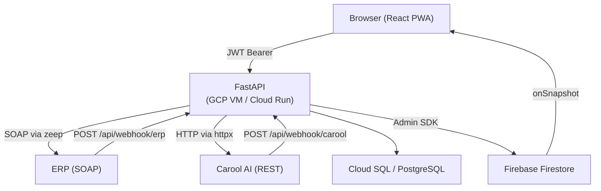

## System diagram



## The three-wave request flow

### Wave 0 — Authentication

```
Browser                 FastAPI              ERP (SOAP)
  │                        │                     │
  ├── POST /api/auth/request-code ──────────► IsValidUser(userCode)
  │                        │◄── "send SMS" ───────┤
  │                        │                     │
  ├── POST /api/auth/verify ────────────────► Login(userCode, otp)
  │                        │◄── approved/denied ──┤
  │◄── { token } ──────────┤
```

The JWT payload is `{ shop_id, erp_hash, exp }`.
The client stores the token in `localStorage` and sends it as `Authorization: Bearer <token>` on every subsequent request.

---

### Wave 1 — Car lookup (open a new order)

```
Browser                 FastAPI              ERP (SOAP)
  │                        │                     │
  ├── POST /api/car ────────────────────────► GetCarData(plate, mileage, shop_id, erp_hash)
  │                        │◄── car data ─────────┤
  │                        ├── INSERT open_orders (status='open')
  │◄── { order_id, recognized, tire_sizes, wheel_count, ... }
```

`request_id` (ERP's own visit identifier) is stored in `open_orders` and forwarded in Wave 2.

---

### Wave 1.5 — Carool photo session (optional, runs alongside Wave 1)

```
Browser                 FastAPI              Carool (REST)
  │                        │                     │
  ├── POST /api/carool/session ─────────────► POST /ai-diagnoses
  │◄── { carool_id } ◄──────────────────────┤
  │                        ├── UPDATE open_orders SET carool_diagnosis_id
  │                        │                     │
  │  [per wheel, up to 4 wheels × 2 photos]      │
  ├── POST /api/carool/photo ───────────────► POST /ai-diagnoses/{id}/sidewall-picture
  ├── POST /api/carool/photo ───────────────► POST /ai-diagnoses/{id}/tread-picture
  │                        │                     │
  ├── POST /api/carool/finalize ────────────► POST /ai-diagnoses/{id}/uploaded
  │                                              │
  │  [Carool fires webhook when analysis done]   │
  POST /api/webhook/carool ◄────────────────────┤
       ├── UPDATE open_orders.diagnosis (Carool results)
       ├── _firestore_signal(shop_id, order_id, status)
```

---

### Wave 2 — Diagnosis submission

```
Browser                 FastAPI              ERP (SOAP)
  │                        │                     │
  ├── POST /api/diagnosis ──────────────────► SubmitDiagnosis(request_id, tires, alignment, carool_id)
  │                        │◄── ok ───────────────┤
  │                        ├── UPDATE open_orders SET status='waiting', diagnosis=...
  │◄── { ack: true } ───────┤
  │                        │                     │
  │  [ERP fires webhook when manager decides]    │
  POST /api/webhook/erp ◄──────────────────────┤
       ├── UPDATE open_orders SET status=approved/declined
       ├── _firestore_signal(shop_id, order_id, new_status)
       │
  Browser ◄── onSnapshot fires ── Firestore
  (UI updates in real time)
```

## Key design principles

1. **ERP adapter isolation** — all SOAP calls live in `backend/adapters/erp.py`. When the ERP team finalises method names and field schemas, only that file changes.
2. **Shop-scoped data** — every DB query includes `WHERE shop_id = <value from JWT>`. Mechanics can never read another shop's orders.
3. **Best-effort Firestore** — the `_firestore_signal` helper swallows exceptions so a Firestore outage never fails the webhook response to the ERP.
4. **Secret Manager** — all credentials are loaded from GCP Secret Manager at startup (`config.py`); no secrets in environment files in production.
